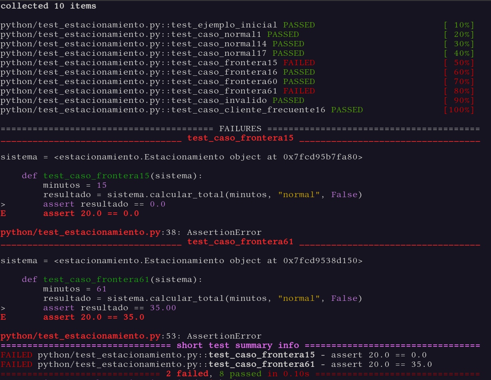
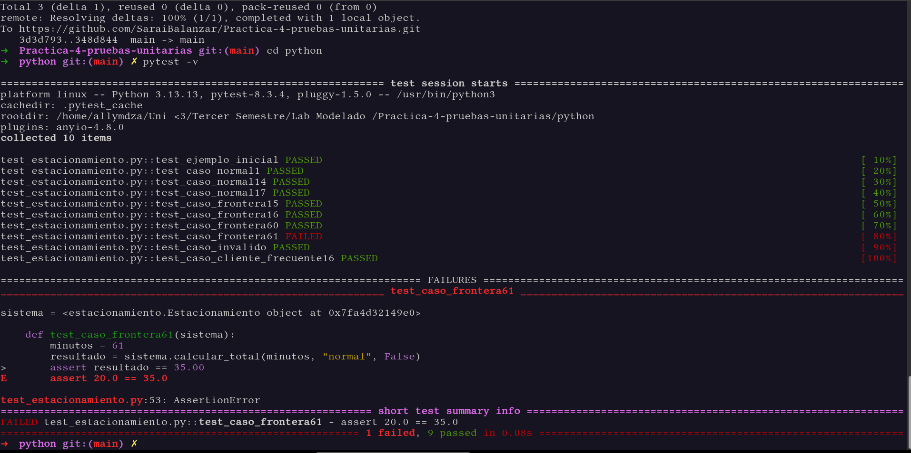
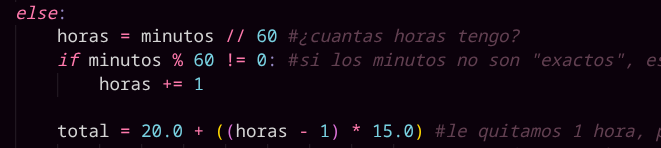
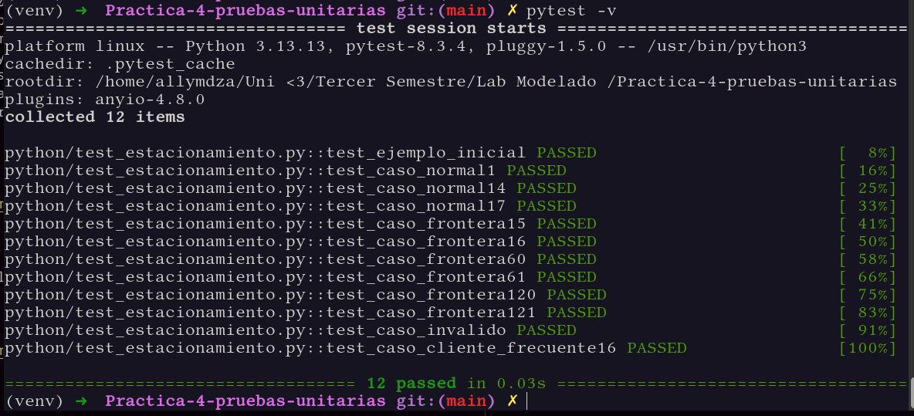

# Versión Python

## Requisitos previos

* **Python 3.8 o superior**


## Ejecutar

```bash
1. Clonar el repositorio: 
    git clone https://github.com/SaraiBalanzar/Practica-4-pruebas-unitarias.git
2. Mover a la carpeta principal: 
    cd Practica-4-pruebas-unitarias
3. Crear y activar un entorno virtual
    - En linux o macOS: 
        python3 -m venv venv
        source venv/bin/activate
    - En windows
        python -m venv venv
        venv\Scripts\activate
4. Instalar las dependencias
    pip install -r requirements.txt
5. Ejecutar las pruebas
    pytest -v
```

El archivo `test_estacionamiento.py` contiene únicamente un ejemplo inicial.
La actividad consiste en diseñar la suite completa a partir del modelo de la práctica.


# Antes de programar las pruebas...
__**Tabla de Casos**__

| Caso |Tipo de Caso | Entrada | Resultado Esperado | Reglas | Justificación
|---|---|---|---|---|---|
| 1 | Caso frontera | 0 minutos - Cliente Normal | $0.00 | Por la regla 4) | Si los minutos son cero, no tiene costo (justo por la definición).
| 2 | Caso frontera | 1 minuto - Cliente Normal | $0.00 | Por la regla 5) | De uno a 15 minutos, no tiene costo (por lo que dice la regla 5).
| 3 | Caso frontera | 15 minutos - Cliente Normal | $0.00 | Por la regla 5) | Lo mismo que dice la regla 5.
| 4 | Caso frontera | 16 minutos - Cliente Normal | $20.00 | Por la regla 6) | A partir de los 16 minutos, empieza el cobro, que es de $20.00.
| 5 | Caso frontera | 60 minutos - Cliente Normal | $20.00 | Por la regla 6) | Hasta los 60 minutos se seguirá cobrando $20.00.
| 6 | Caso frontera | 61 minutos - Cliente Normal | $35.00 | Por la regla 7) | Pasando un minuto de la hora, se cobrará en $20.00 por la primer hora y después, $15.00 más por la siguiente hora iniciada.
| 7 | Caso frontera | 120 minutos - Cliente Normal | $35.00 | Por la regla 7) | Se sigue cobrando $35.00 hasta que no empiece la siguiente hora. 
| 8 | Caso frontera | 121 minutos - Cliente Normal | $50.00 | Por la regla 7) | Se cobrará $15.00 más, pues ya empezó otra hora.
| 9 | Caso normal | 5 minutos - Cliente Normal | $0.00 | Por la regla 4) | No tiene costo, está dentro de los primeros 15 minutos.
| 10 | Caso normal | 30 minutos - Cliente Normal | $20.00 | Por la regla 6) | Empieza el cobro.
| 11 | Caso normal | 70 minutos - Cliente Normal | $35.00 | Por la regla 7) | Está dentro de la hora que sigue, en la que se cobra los $20.00 de los primeros 15 minutos y los $15.00 de la primera hora.
| 12 | Caso inválido | -10 minutos - Cliente Normal | Lanza Error | Por la regla 1) | No hay tiempo negativo.
| 13 | Caso inválido | 0 minutos - Cliente Especial | Lanza Error | Por la regla 2) | No existen clientes de tipo "especiales"
| 14 | Caso con interración entre reglas | Boleto perdido - Cliente Frecuente | $300.00 | Por la regla 3) y 8) | A pesar de que sea un cliente frecuente y tenga un descuento en su cobro final, se le cobrará el monto completo por perder el boleto.
| 15 | Caso con interacción entre reglas | 16 minutos - Cliente Frecuente | $18.00 | Por la regla 6) y 8) | A partir de los 16 minutos, se cobra $20.00, pero como es un cliente frecuente, se le descuenta el 10%, que son dos pesos en este caso.
| 16 | Caso con decimales | 181 minutos - Cliente Frecuente | $58.5 | Por la regla 7) y 8) | Se cobra lo de los 16 minutos que son $20.00, pasa la primera hora, se suman $15.00, pasa otra hora y se suman $15.00, se quedó un minuto más, es decir, inció otra hora, le añadimos otros $15.00, que al final suma $65.00, como es un cliente frecuente, entonces le debemos de dar un descuento del 10% que son $6.5, se lo restamos al total y nos queda $58.5.
| 17 | Caso propuesto: Costo de dejar el coche todo un dia | 1440 minutos - Cliente Normal | $380.00 | Por la regla 7) | Un día tiene 1440 minutos, es decir, 24 horas, tomamos los 15 minutos gratis, luego cobramos $20.00 a los 16 minutos, luego, pasa la primera hora y le cobramos $15.00, para simplificar los cálculos, debemos de multiplicar las 24 horas por $15.00, y sumarle los $20.00, que nos da un total de $380.00.

# Durante la implementación...
En esta primera parte, se implementaron los test:
`test_ejemplo_inicial(sistema); test_caso_normal1(sistema); test_caso_normal14(sistema); test_caso_normal17(sistema); test_caso_frontera15(sistema); test_caso_frontera16(sistema); test_caso_frontera60(sistema); test_caso_frontera61(sistema); test_caso_invalido(sistema); test_caso_cliente_frecuente16(sistema)`

Que, al ejecutar pytest, obtenemos lo siguiente:

<div align="center">



</div>

Vemos que las pruebas que fallaron fueron en dos fronteras, en la frontera de 15 minutos y en la frontera de 61 minutos, revisamos lo que nos arrojó pytest, y vemos que la funcion `calcular_total(minutos, tipo_cliente, boleto_perdido)` debe de tener algún error, pues la variable resultado tomó el valor de 20.00 cuando debia de ser de 0.0.

Respecto a la frontera de 15 minutos, debíamos de colocar un =, para que tome en cuenta que en el minuto 15, aún no empieza el cobro.

<div align="center">



</div>

Vemos que la prueba ya pasa con esa modificación que hicimos. Ahora, modificamos el código en la parte de `else`, pues calculaba mal el cobro, hacia lo que se muestra en la imagen de arriba, lo que debemos considerar es el total de horas que tenemos, esto dividiendo (enteramente) a los minutos entre 60, y después verificamos que si los minutos no son múltiplos de 60, entonces la hora se sume, pues lo que buscamos es que si por ejemplo, estamos en el minuto 120, aun no se cobren otros $15.00, pero si estamos en el minuto 121, ahora si lo cobremos, y esto es posible añadiendo otra hora a nuestro conteo. Finalmente, modificamos nuestro total, quitándole una hora a las horas totales, pues ya la cobramos (de alguna manera) cuando se rebasó los 15 minutos, y cobramos $20.00, pues de ahí el cobro a la siguiente hora será a los 61 minutos... resumidamente, le quitamos una hora para no cobrar de más. Quedando nuestro código de la siguiente manera:
 
<div align="center">



</div>

Ahora, resta correr las pruebas y ver que sucede:

<div align="center">



</div>

Todas las pruebas pasan :)


# Análisis

*1. ¿Qué diferencia hay entre un caso normal y un caso frontera?*

*2. ¿Cuál de sus pruebas considera más importante y por qué?*

*3. ¿Encontró algún comportamiento de la implementación que no coincida con el modelo?*

*4. ¿Una suite con 100 % de pruebas aprobadas demuestra que el programa es correcto? Explique.*

*5. Si una IA generara automáticamente 50 pruebas, ¿qué tendría que revisar una persona antes de confiar en ellas?*